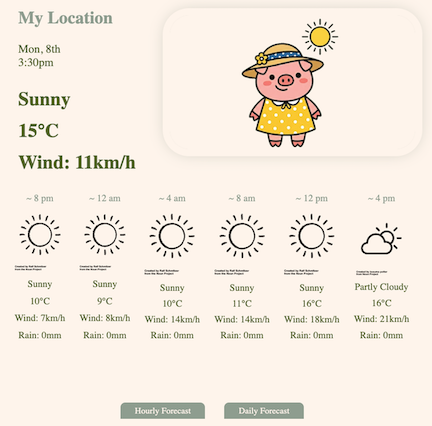

# My Weather App

A responsive weather dashboard built with React and TypeScript, powered by the free [Open Meteo API](https://open-meteo.com/). Get current weather conditions, hourly forecasts, and 6-day forecasts—no API key required. Weather data from the API is updated every 15 minutes.

## About the Project and Background Story

My Weather App features current weather conditions, hourly forecasts for the next 24 hours, and a 6-day forecast. I made this app to share weather information with my family who live in different parts of the globe. It currenly shows Melbourne's weather. My plan is to add locations for my family. I'm also planning to turn this into a mobile app too.

## Learning

Building this app involved thiking about how I want to structure it. I chose to use React Context and React Router. Using Context gave me cleaner handling of fetching weather data from the API, to share it with the current weather, hourly/six-day forecast components. I may try to replace this with Zustand in the future. I used React Router to switch between the hourly forecast and the six-day forecast for a simpler UI for users. I also paid attention to file structure. I tried to organise the project cleanly so it would be smooth to navigate for developers including myself in the future within the project.
I generated all weather images for the current weather section using Gemini AI. I tried a few AI image generation tools. While doing so, I eventually got the hang of how I should phrase AI instructions. I used Gemini to create an image background removal tool, so I could use the images for my app.

## Tech Stack

- **React 19** — Modern UI framework
- **TypeScript** — Type-safe development
- **Vite** — Lightning-fast build tool and dev server
- **React Router** — Client-side navigation between forecast views
- **Open Meteo API** — Free weather data (no API key required)
- **ESLint** — Code quality and consistency

## Installation

### Prerequisites

- Node.js 18+ and npm (or yarn/pnpm)

### Steps

1. **Clone the repository**

   ```bash
   git clone <repository-url>
   cd my-weather-app
   ```

2. **Install dependencies**

   ```bash
   npm install
   ```

3. **Start the development server**

   ```bash
   npm run dev
   ```

   The app will be available at `http://localhost:5173`

4. **Build for production**
   ```bash
   npm run build
   ```
   Production files will be in the `dist/` directory

## Usage

1. **View Current Weather** — The main dashboard displays the current temperature, weather condition, wind speed, for the location.

2. **Hourly Forecast** — Click the "Hourly Forecast" link to see temperature, conditions, wind speed and precipitation for the next 24 hours.

3. **6-Day Forecast** — Click the "Daily Forecast" link to view a detailed 6-day outlook with high/low temperatures, conditions, UV index and weather conditions.

4. **Responsive Design** — The app works seamlessly on mobile, tablet, and desktop devices.

## Demo

**URL:** https://my-weather-app-jrnm.onrender.com

Visit the link above to see the app in action, or run it locally following the Installation steps above.

**App Image**



## Features

- ⛅ **Current Weather Display** — Current temperature, condition and wind speed
- 📊 **Hourly Forecast** — Next 24 hours of temperature, weather conditions and precipitation data
- 📅 **6-Day Daily Forecast** — Extended outlook with high/low temperatures, wind speed and UV index
- 🎨 **Weather Icons** — WMO-based weather code mapping with intuitive icons
- 📱 **Responsive Design** — Mobile-first layout that adapts to all screen sizes
- ⚡ **Fast Performance** — Optimized with Vite for quick load times
- 🔓 **No Authentication** — Open Meteo API is completely free and requires no API key

## Project Status & Roadmap

### Current (v0.1)

- ✅ Single fixed location weather data
- ✅ Current conditions display
- ✅ Hourly forecast (24 hours)
- ✅ 6-day daily forecast
- ✅ Responsive UI (mobile & desktop)
- ✅ WMO weather code mapping

### Planned Features

- 🔄 Multi-location support
- 🔄 Location search functionality
- 🔄 Add Night theme using 'Is Day or Night' for current weather

### Ideas for Improvement

- 🔄 Create a mobile app version for easier sharing
- 🔄 Use Zustand or equivalent to replace context

## Attribution

### Many thanks to Noun Project

https://thenounproject.com/icon/sun-1108413/
https://thenounproject.com/icon/sunny-8277109/
https://thenounproject.com/icon/cloudy-8343643/
https://thenounproject.com/icon/drizzle-4377915/?utm_source=nounproject&utm_campaign=icon_match&utm_content=match_drawer
https://thenounproject.com/icon/drizzling-6514234/
https://thenounproject.com/icon/rain-umbrella-8311570/?utm_source=nounproject&utm_campaign=icon_match&utm_content=match_drawer
https://thenounproject.com/icon/storm-8177770/
https://thenounproject.com/icon/pig-8361061/
https://thenounproject.com/icon/misty-719464/
https://thenounproject.com/icon/hazy-sun-2525892/
https://thenounproject.com/icon/fog-7418701/
https://thenounproject.com/icon/snow-cloud-5936878/?utm_source=nounproject&utm_campaign=icon_match&utm_content=match_drawer
https://thenounproject.com/icon/lightning-7760481/?utm_source=nounproject&utm_campaign=icon_match&utm_content=match_drawer
